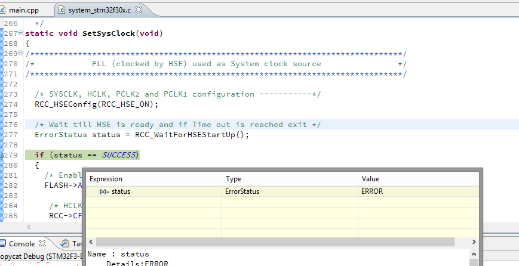

# STM32F3-Discovery example project

## Dealbreaker

### Cause / Solution

While some sources mention the solder bridge SB12 missing on the STM32-Discovery board (which wasn't missing on mine), it turned out that it really was the R48 100 Ω resistor was actually defect. After replacing it with spare parts from some old scanner board, everything works perfectly fine.

In this branch, the system outputs the HSE clock to pin PA8 in order to externally verify the signal.  

### Problem

Currently, the board will run only at 8 MHz because of the HSE not starting up.

