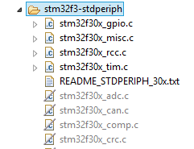

# copycat - an STM32F3-Discovery example project

This is an example project for getting used to the STM32F3-Discovery board and STM32F303VCT6 MCU.

## Little Things

### Eclipse

If functions from included headers cannot be found according to GCC, they may be filtered out by Eclipse. In order to re-enable filtered-out source files such as `stm32f30x_adc.c` etc. in the following image

their *Source Location Filter* needs to be removed from *Project Properties > C/C++ General > Paths and Symbols > Source Location*. There, click *Edit Filter ...* and then *Remove*.